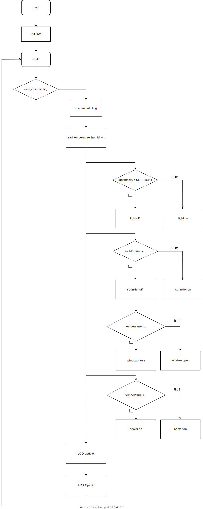

# greenhouse_project

### Členové týmu

* [Martin Kousal](https://github.com/mkousal)
* [Jiří Navrátil](https://github.com/georgenavratil)
* [Tomáš Kříčka](https://github.com/tomaskricka)

Odkaz na GitHub repozitář:

[https://github.com/mkousal/greenhouse_project](https://github.com/mkousal/greenhouse_project)

### Obsah

* [Cíle projektu](#objectives)
* [Popis hadware](#hardware)
* [Popis knihoven](#libs)
* [Hlavní aplikace](#main)
* [Video](#video)
* [Reference](#references)

## Cíle projektu

Cílem projektu je navrhnout chytrý skleník, který bude za měnících podmínek uchovávat ve skleníku co nejlepší podmínky pro pěstování zeleniny.

## Popis hardware

V projektu používáme:
* Arduinu UNO - mikrocontroler s AVR procesorem [Atmega283P](https://ww1.microchip.com/downloads/en/DeviceDoc/Atmel-7810-Automotive-Microcontrollers-ATmega328P_Datasheet.pdf)
* senzor teploty a vlhkosti - [DHT12](https://robototehnika.ru/file/DHT12.pdf) komunikuje s Arduinem přes I2C sběrnici
* senzor vlhkosti půdy -  [capacitive soil moisture sensor v1.2](https://www.sigmaelectronica.net/wp-content/uploads/2018/04/sen0193-humedad-de-suelos.pdf) změnou kapacity měří vlhkost půdy
* intenzita světla - [GL5539 photoresistor](https://www.kth.se/social/files/54ef17dbf27654753f437c56/GL5537.pdf) změnou odporu měří intentitu světla
* znakový display 2*16 - [LCD keypad shield](https://asset.conrad.com/media10/add/160267/c1/-/gl/002134138ML00/manual-2134138-makerfactory-modul-displeje-56-cm-222-palec-16-x-2-pixel-vhodne-pro-arduino-s-podsvicenim-displeje.pdf) využívá I2C sběrnici
* relé modul - [4 relay shield, Calatex](https://www.distrelec.cz/Web/Downloads/_t/ds/103030009_eng_tds.pdf) spínáním relé je ovládáno zavlažování, světlo, ventilace, topení

## Popis knihoven

* adc.h - nastavuje základní funkce jako je předdělička, reference, enable, selected chanel

* dht.h, dht.c - zde jsou definovány funkce pro získání hodnoty teploty a vlhkosti za použití I2C sběrnice

* gpio.h, gpio.c - knihovna slouží k obsluze vstupních/výstupních pinů

* lcd.h, lcd.c - knihovna pro ovládání LDC display

* lcd_definitoin.h - zde jsou definovány vstupní piny pro display

* relay.h, relay.c - zde jsou definovány funkce a vstupní piny pro ovládání relé za použití knihovny gpio.h

* timer.h - knihovna s interrupty

* twi.h, twi.c - knihovna pro I2C komunikace

* uart.h, uart.c - knihovna slouží k asynchonímu přenosu dat

## Hlavní aplikace

Hlavní aplikace zajišťuje co nejpřívětivější podmínky pro pěstování zeleniny ve skleníku. podmínky jsou zajištěny třemi senzory zjišťující teplotu ovzduší, intenzitu světla, vlhkost vzduchu a vlhkost zeminy.
Logika programu se řídí dle níže přiložených flowchartů. 
Veškeré aktuální naměřené hodnoty se ukazují na LDC display pro případnou vyzuální knontrolu.

K ovládání externího hardware, které zajišťuje ideální podmínky je využit relé shield se čtyřmi relé. 
Relé 1 ovládá ventilaci, sepnutím tohoto relé dojde k otevření ventilačního okna a snížení teploty a vlhkosti ve skleníku. 
Relé 2 ovládá ohřev ve skleníku, ohřej je využit když klesne teplota ve skleníku pod 15°C. 
Využije se zejména k výsadbě na jaře nebo dozrávání na podzim nebo k přezimování venkovních květin.
Relé 3 je určeno k rozsvěcování světel, jakmile klesne intenzita pod dení osvětlení, rozsvítí se výkonné zářivky, které v jisté míře dokáží nahradit sluneční záření. 
Poslední 4 relé je využito k nejdůležitejší činnosti a to k závlaze zeleniny. 
Když klesne vlhkost zeminy pod nastavenou hodnotu sepne se zavlažování a voda bude dodávána dokud vlhkost nebude na ideálních hodnotách.

Doporučujeme skalibrovat před použitím veškeré senzory, jelikož hodnoty jsou nastaveny na výchozí hodnoty a požadavky se můžou lišit pro každý skleník.

 

## Video

Ve videu jsme použili hodnoty tak, aby se nám dobře demostrovala funčnost zařízení.
[Video na youtube]()

## Reference

1. Microchip studio
2. Visual studio code
3. Kicad
4. Gitbash
5. [Zadání projektu](https://github.com/tomas-fryza/Digital-electronics-2/tree/master/Labs/project)