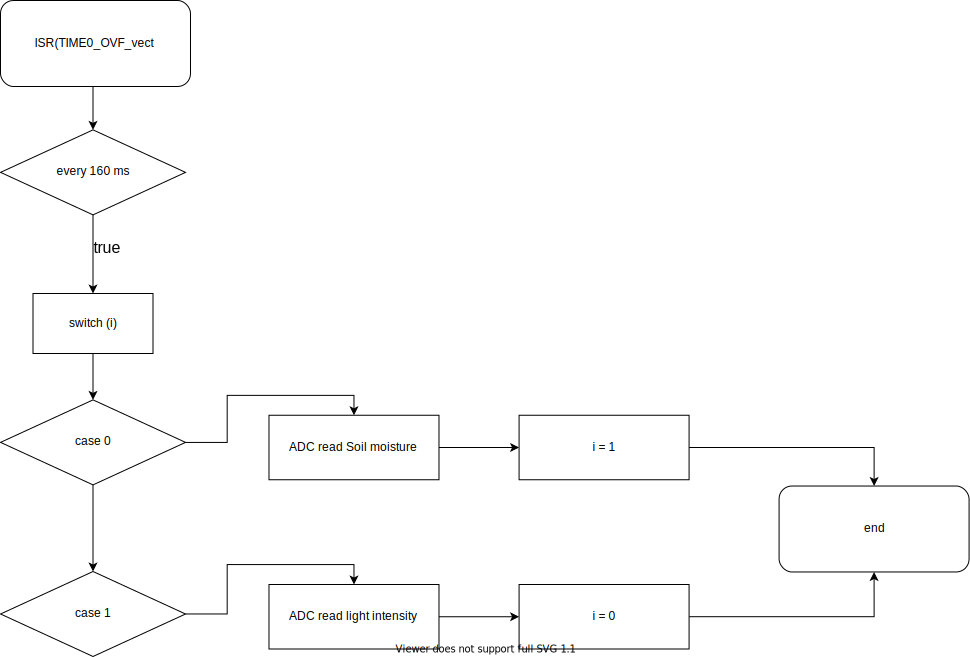

# greenhouse_project

### Členové týmu

* [Martin Kousal](https://github.com/mkousal)
* [Jiří Navrátil](https://github.com/georgenavratil)
* [Tomáš Kříčka](https://github.com/tomaskricka)

Odkaz na GitHub repozitář:

[https://github.com/mkousal/greenhouse_project](https://github.com/mkousal/greenhouse_project)

### Obsah

- [greenhouse_project](#greenhouse_project)
    - [Členové týmu](#členové-týmu)
    - [Obsah](#obsah)
  - [Cíle projektu](#cíle-projektu)
  - [Popis hardware](#popis-hardware)
    - [Schéma zapojení](#schéma-zapojení)
  - [Popis knihoven](#popis-knihoven)
  - [Hlavní aplikace](#hlavní-aplikace)
    - [Zdrojové soubory](#zdrojové-soubory)
  - [Flowcharty](#flowcharty)
  - [Video](#video)
  - [Reference na použité programy a dokumenty](#reference-na-použité-programy-a-dokumenty)

## Cíle projektu

Cílem projektu je navrhnout chytrý skleník, který bude za měnících se podmínek uchovávat ve skleníku co nejlepší podmínky pro pěstování zeleniny.

## Popis hardware

V projektu používáme:
* Arduino UNO - mikrokontroler s AVR procesorem [Atmega283P](https://ww1.microchip.com/downloads/en/DeviceDoc/Atmel-7810-Automotive-Microcontrollers-ATmega328P_Datasheet.pdf)
* Senzor teploty a vlhkosti - [DHT12](https://robototehnika.ru/file/DHT12.pdf) komunikuje s Arduinem přes I2C sběrnici
* Senzor vlhkosti půdy -  [capacitive soil moisture sensor v1.2](https://www.sigmaelectronica.net/wp-content/uploads/2018/04/sen0193-humedad-de-suelos.pdf) změnou kapacity (a následně napětí na něm) měří vlhkost půdy
* Intenzita světla - [GL5539 photoresistor](https://www.kth.se/social/files/54ef17dbf27654753f437c56/GL5537.pdf) změnou odporu měří intenzitu světla
* Znakový display 2*16 - [LCD keypad shield](https://asset.conrad.com/media10/add/160267/c1/-/gl/002134138ML00/manual-2134138-makerfactory-modul-displeje-56-cm-222-palec-16-x-2-pixel-vhodne-pro-arduino-s-podsvicenim-displeje.pdf) využívá I2C sběrnici
* Relé modul - [4 relay shield, Calatex](https://www.distrelec.cz/Web/Downloads/_t/ds/103030009_eng_tds.pdf) spínáním relé je ovládáno zavlažování, ovládání světla, ventilace a topení

### Schéma zapojení

## Popis knihoven

* `adc.h` - nastavuje základní funkce jako je předdělička AD převodníku, reference, spouštění, výběr kanálu, spuštění interruptu po převodu

* `dht.h`, `dht.c` - zde jsou definovány funkce pro získání hodnoty teploty a vlhkosti za použití I2C sběrnice reflektující rozložení přijatých bytů dle datasheetu a následně zaokrouhlení teploty na celé stupně Celsia

* `gpio.h`, `gpio.c` - knihovna sloužící k obsluze vstupních/výstupních pinů

* `lcd.h`, `lcd.c` - knihovna pro ovládání LCD

* `lcd_definition.h` - definice pinů pro LCD

* `relay.h`, `relay.c` - zde jsou definovány funkce a vstupní piny pro ovládání relé za použití knihovny `gpio.h`

* `timer.h` - knihovna pro AVR sloužící k obsluze časovačů

* `twi.h`, `twi.c` - knihovna pro I2C komunikaci

* `uart.h`, `uart.c` - knihovna k obsluze UART sběrnice

## Hlavní aplikace

Aplikace zajišťuje co nejpřívětivější podmínky pro pěstování zeleniny ve skleníku. Podmínky jsou zajištěny třemi senzory zjišťující teplotu ovzduší, intenzitu světla, vlhkost vzduchu a vlhkost zeminy. Logika programu se řídí dle níže přiložených flowchartů. 
Veškeré aktuální naměřené hodnoty se ukazují na LCD pro případnou vizuální kontrolu. Viz níže přiložený obrázek. Bohužel se nedařilo vyfotit ostrý text na displeji, proto není moc vidět.

K ovládání externího hardware, které zajišťuje ideální podmínky je využit relé shield se čtyřmi relé. 
**Relé 1** ovládá ventilaci, sepnutím tohoto relé dojde k otevření ventilačního okna a tím pádem ke snížení teploty a vlhkosti vzduchu ve skleníku. 
**Relé 2** ovládá ohřev ve skleníku, ohřej je využit když klesne teplota ve skleníku pod 15°C. 
Využije se zejména k výsadbě na jaře nebo dozrávání na podzim, nebo k přezimování venkovních květin.
**Relé 3** je určeno k rozsvěcování světel, jakmile klesne intenzita pod denní osvětlení, rozsvítí se výkonné zářivky, které v jisté míře dokáží nahradit sluneční záření. 
**Relé 4** je využito k nejdůležitější činnosti a to k závlaze zeleniny. 
Když klesne vlhkost zeminy pod nastavenou hodnotu sepne se zavlažování a voda bude dodávána dokud vlhkost nebude na ideálních hodnotách.

Doporučujeme zkalibrovat před použitím veškeré senzory, jelikož hodnoty jsou nastaveny na výchozí hodnoty a požadavky se můžou lišit pro každý skleník. Nastavení všech hodnot při kterých se budou spínat jednotlivé akční prvky se provádí pomocí konstant definovaných na začátku souboru `main.c` viz obrázek níže.

### Zdrojové soubory

Celá aplikace se skládá z hlavního `main.c` souboru a již dříve zmíněných knihoven. Celý projekt a všechny tyto soubory lze nalézt v repozitáři po kliknutí [zde](https://github.com/mkousal/greenhouse_project/tree/main/fw/greenhouse/greenhouse).

Vygenerovaný `.hex` soubor je k dispozici po kliknutí [zde](https://github.com/mkousal/greenhouse_project/blob/main/fw/greenhouse/greenhouse/Debug/greenhouse.hex).

## Flowcharty

Hlavní funkce.

Ke spuštění funkce dojde každých 8 sekund.

Každých 160 ms dojde k zapnutí ADC kanálu.

Když je dokončený převod dojde ke spuštění této funkce.

## Video

Ve videu jsme použili hodnoty tak, aby se nám dobře demonstrovala funkčnost zařízení, takže neodpovídají reálnému nastavení použitém ve skleníku.

[Video na youtube]()

## Reference na použité programy a dokumenty

1. [Microchip studio](https://www.microchip.com/en-us/development-tools-tools-and-software/microchip-studio-for-avr-and-sam-devices)
2. [Visual studio code](https://code.visualstudio.com/)
3. [KiCad](https://www.kicad.org/)
4. [Git](https://git-scm.com/)
5. [Zadání projektu](https://github.com/tomas-fryza/Digital-electronics-2/tree/master/Labs/project)
6. [DaVinci resolve 17](https://www.blackmagicdesign.com/products/davinciresolve/)